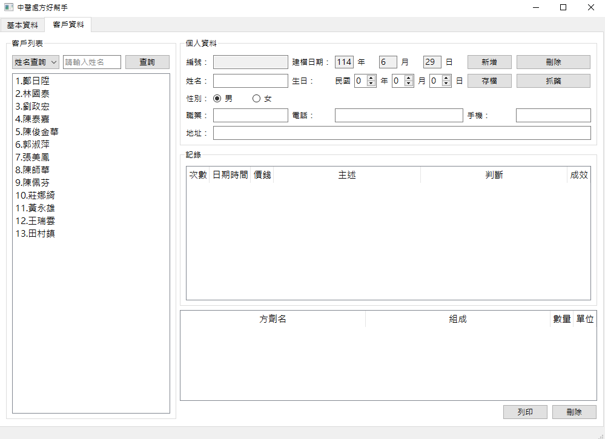
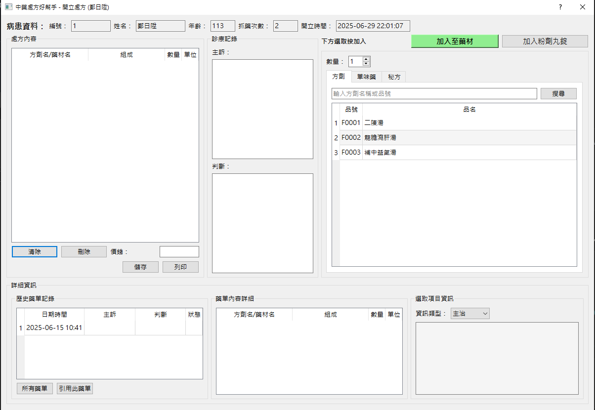
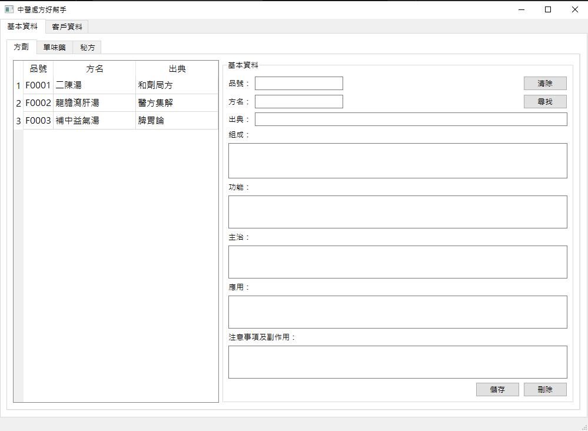

# 中醫處方好幫手 (Chinese Medicine Prescription Assistant)

一個基於 PyQt5 的中醫處方管理系統，提供客戶資料管理、方劑資料庫維護、處方開立等功能。

## 功能特色

### 🏥 客戶管理
- 客戶基本資料建檔與維護
- 多種查詢方式：姓名、生日、電話、手機
- 就診記錄管理與歷史查詢

### 💊 藥材資料庫
- **方劑管理**：組成、功能、主治、應用、注意事項
- **單味藥管理**：性味、功能、主治、應用、副作用
- **秘方管理**：私人方劑配方管理

### 📋 處方開立
- 直觀的處方開立界面
- 支援方劑、單味藥混合處方
- 歷史處方查詢與引用
- 處方明細記錄與列印

### 📊 診療記錄
- 主訴與判斷記錄
- 處方歷史追蹤
- 療效評估記錄

## 技術架構

### 前端界面
- **PyQt5**: 主要 GUI 框架
- **Qt Designer**: UI 設計工具 (.ui 檔案)
- 響應式表格與自適應布局

### 後端數據
- **MySQL**: 主要資料庫
- **mysql-connector-python**: 資料庫連接器
- 事務管理與資料完整性保護

### 系統架構
```
├── main.py                     # 主程式入口
├── database_manager.py         # 資料庫管理層
├── customer_manager.py         # 客戶管理模組
├── prescription_manager.py     # 處方開立模組
├── formula_manager.py          # 方劑管理模組
├── herb_manager.py            # 單味藥管理模組
├── secret_formula_manager.py   # 秘方管理模組
├── config_manager.py          # 設定檔管理工具
├── config.py                  # 系統設定
├── *.ui                       # Qt Designer 界面檔案
└── database_config.json       # 資料庫連接設定
```

## 安裝需求

### Python 環境
```bash
Python 3.7+
```

### 依賴套件
```bash
PyQt5>=5.15.0
mysql-connector-python>=8.0.0
```

### 資料庫需求
- MySQL 5.7+ / MariaDB 10.2+
- 支援 UTF-8 字元編碼

## 快速開始

### 1. 環境準備
```bash
# 克隆專案
git clone https://github.com/leon735051/chinese-medicine-prescription.git
cd chinese-medicine-prescription

# 安裝依賴
pip install -r requirements.txt
```

### 2. 資料庫設定
```bash
# 編輯資料庫設定檔
# database_config.json

{
    "host": "localhost",
    "database": "chinese_medicine_db",
    "user": "your_username",
    "password": "your_password",
    "port": 3306,
    "charset": "utf8mb4"
}
```

### 3. 設定檔管理
```bash
# 使用設定管理工具
python config_manager.py

# 功能：
# 1. 顯示當前設定
# 2. 測試資料庫連接
# 3. 修改設定
# 4. 建立範例設定檔
```

### 4. 啟動系統
```bash
python main.py
```

## 資料庫結構

### 核心資料表
- `customers`: 客戶基本資料
- `records`: 就診記錄
- `prescriptions`: 處方明細
- `formulas`: 方劑資料庫
- `medicines`: 單味藥資料庫  
- `secret_formulas`: 秘方資料庫

### 關聯設計
- 支援外鍵約束與級聯刪除
- 事務管理確保資料一致性
- 適當的索引優化查詢效能

## 核心功能模組

### CustomerManager
- 客戶 CRUD 操作
- 多條件搜尋
- 記錄關聯管理

### PrescriptionManager  
- 處方開立流程
- 藥材選擇與加入
- 歷史處方引用
- 即時價格計算

### DatabaseManager
- 連接池管理
- 查詢執行與異常處理
- 事務控制

## 開發特點

### 模組化設計
- 清晰的 MVC 架構分離
- 可重用的組件設計
- 易於擴展的插件架構

### 用戶體驗
- 直觀的操作流程
- 鍵盤快捷鍵支援
- 自適應表格寬度

### 資料安全
- 參數化查詢防止 SQL 注入
- 事務回滾機制
- 敏感資料保護

## 系統需求

### 最低需求
- Windows 7+ / macOS 10.12+ / Linux (Ubuntu 16.04+)
- 4GB RAM
- 100MB 可用磁碟空間

### 建議需求  
- Windows 10+ / macOS 10.15+ / Linux (Ubuntu 20.04+)
- 8GB RAM
- 1GB 可用磁碟空間

## 📸 系統截圖

### 客戶管理

*客戶資料建檔、查詢與就診記錄管理*

### 處方開立

*直觀的處方開立界面，支援方劑與單味藥混合處方*

### 藥材資料庫

*完整的方劑、單味藥、秘方資料庫管理*

## 貢獻指南

### 開發環境設置
1. Fork 此專案
2. 建立功能分支 (`git checkout -b feature/AmazingFeature`)
3. 提交變更 (`git commit -m 'Add some AmazingFeature'`)
4. 推送到分支 (`git push origin feature/AmazingFeature`)
5. 開啟 Pull Request

### 程式碼規範
- 遵循 PEP 8 Python 程式碼風格
- 添加適當的註解與文檔
- 確保向後兼容性

## 聯絡資訊

- 專案維護者: Damo
- 專案首頁: https://github.com/leon735051/chinese-medicine-prescription
